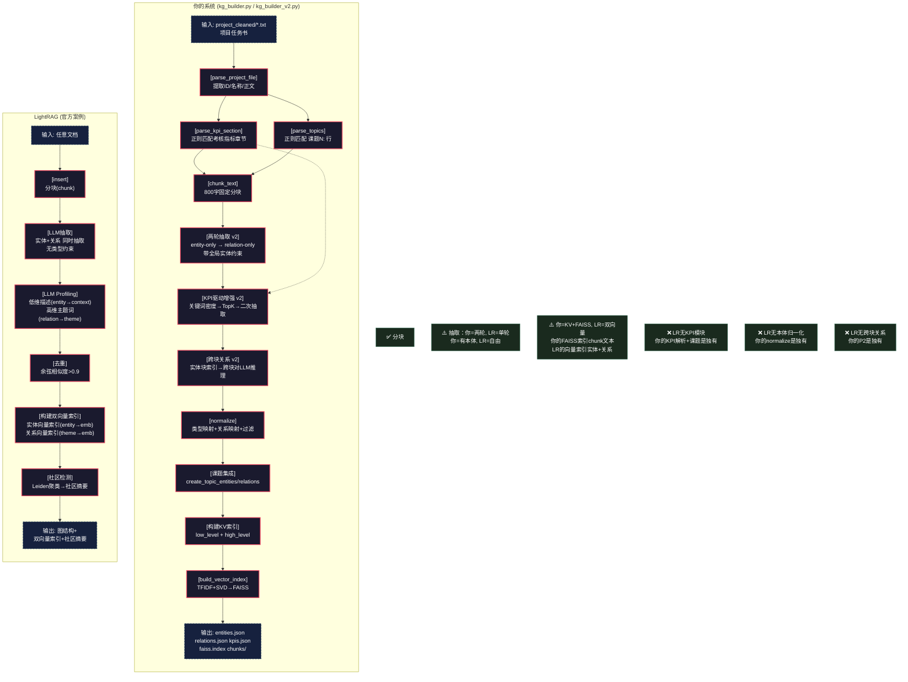
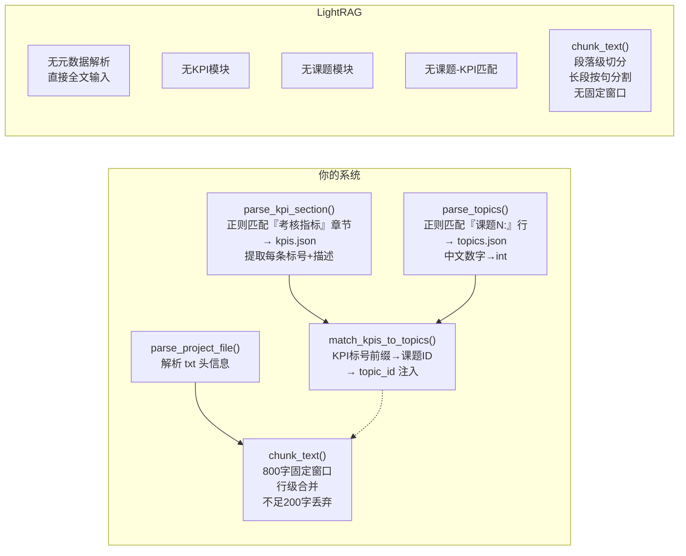
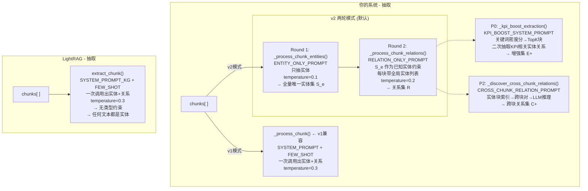
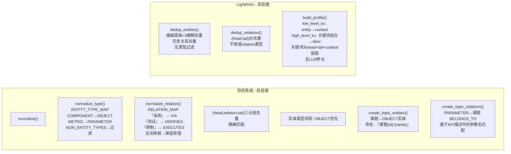
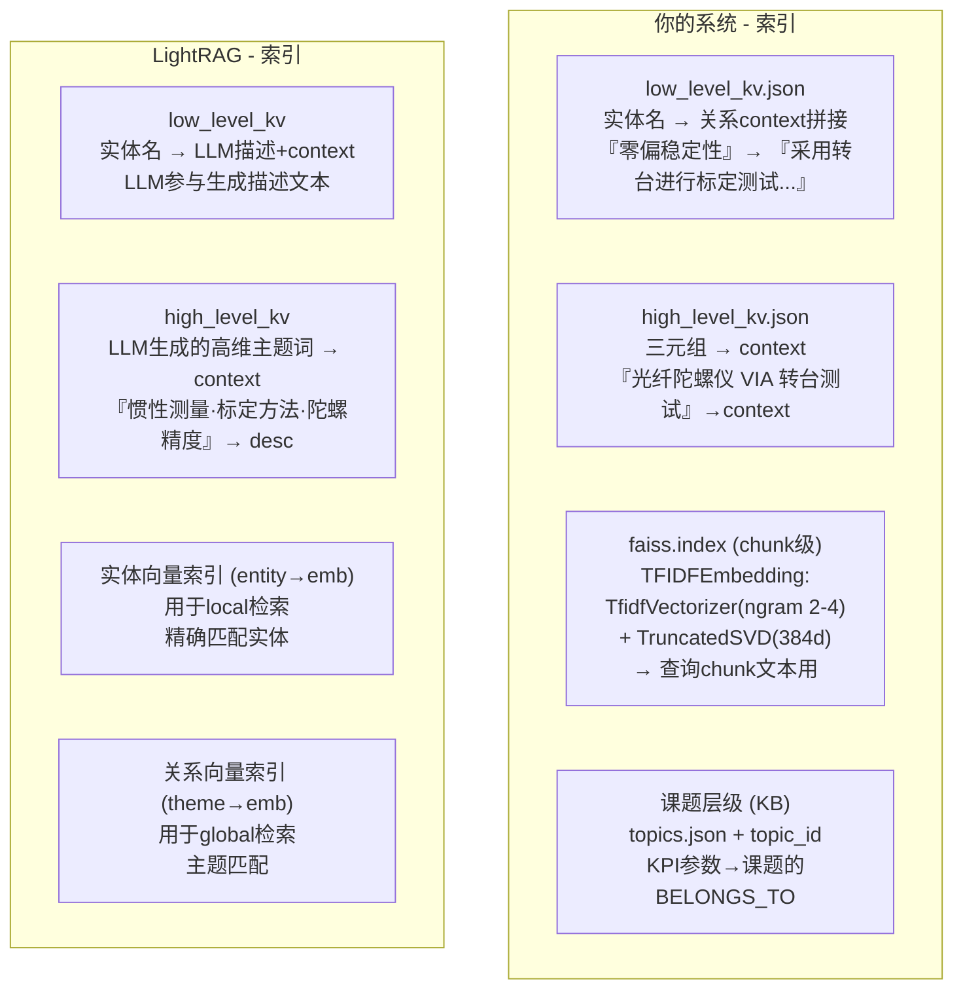
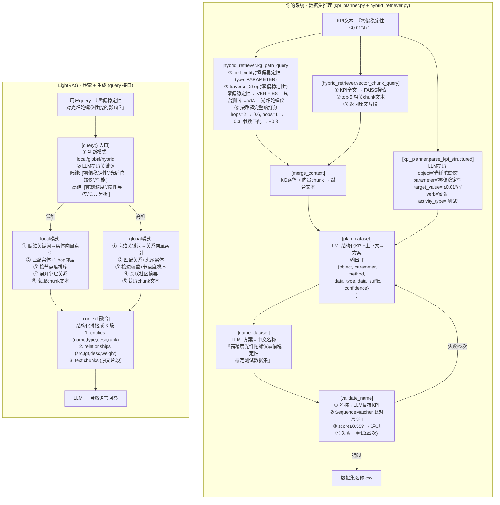
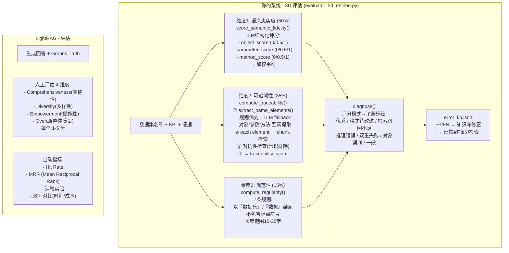

# 代码逻辑 vs LightRAG 逐模块对比

> 本文件以**代码逻辑粒度**梳理你的系统，并逐模块与 LightRAG 对比。
> 图中 ✅ = 你的系统有此功能，❌ = LightRAG 无此功能，⚠️ = 部分有但方式不同。

---

## 一、全流程概览（代码文件映射）




---

## 二、Phase 1: KG 构建 — 逐函数对比

### 2.1 预处理模块



**关键代码差异**：

| 函数 | 你的代码 | LightRAG |
|------|---------|----------|
| `parse_project_file` | 提取 name/ID/projectNo 元数据 | 无对应，直接 insert 全文 |
| `parse_kpi_section` | 三段正则匹配考核指标章节 | ❌ 无 |
| `parse_topics` | `课题/任务 N：名称` 正则 | ❌ 无 |
| `_cn_to_int` | 中文数字→阿拉伯数字 | ❌ 无 |
| `match_kpis_to_topics` | ID点号前缀→课题分组 | ❌ 无 |
| `chunk_text` | 800字窗口，行级融合 | 段落级，句级分割长段 |

### 2.2 抽取模块



**Prompt 对比**：

```
你的 ENTITY_ONLY_PROMPT：
  "你是一个科研实体抽取专家...只输出实体，不抽取关系...
   实体类型：OBJECT/METHOD/PARAMETER/ACTIVITY/EQUIPMENT..."
  → 有类型枚举，有约束，有方向

你的 RELATION_ONLY_PROMPT：
  "给定已知实体列表：
    光纤陀螺仪 (OBJECT)
    零偏稳定性 (PARAMETER)
    转台 (EQUIPMENT)
    ...
   请从文本中找出关系，head/tail 必须来自此列表"
  → 有约束，有过滤，防幻觉

LightRAG 的 SYSTEM_PROMPT_KG：
  "实体类型不由预定义列表限制，请根据文本内容动态判断最合适的类型"
  → 无约束，完全自由
```

### 2.3 后处理模块



**对比**：

| 步骤 | 你的系统 | LightRAG |
|------|---------|----------|
| 类型归一化 | 9种+过滤，精确 | 无，直接保留 |
| 关系归一化 | 6种谓词 + 规则映射 | 无，自由保留 |
| 去重策略 | 精确三元组去重 | 模糊编辑距离 (损失精度) |
| 课题集成 | 独有 | ❌ 无 |
| BELONGS_TO 关系 | 独有 | ❌ 无 |
| 过滤非技术实体 | `NON_ENTITY_TYPES` | ❌ 无 |

### 2.4 索引构建



**本质区别**：

```
你的 KV 索引构建：
  low_level_kv[entity] = "；".join(rel_context for rel in relations if entity in rel)
  → 纯拼接，无 LLM 参与，无主题提取

LightRAG 的 KV 索引构建：
  low_level_kv[entity] = LLM(entity + relation_contexts → 生成描述)
  high_level_kv[theme] = LLM(head + relation + tail + context → 提取高维主题词)
  → LLM 参与理解语义，提取抽象主题词
```

---

## 三、Phase 2: 检索 + 推理 — 逐模块对比



### 检索机制逐行对比（代码逻辑级）

| 步骤 | 你的系统 | LightRAG |
|------|---------|----------|
| **查询输入** | `KPI描述文本`（结构化指标） | `任意用户query`（自然语言） |
| **关键词提取** | 无（直接用 KPI 文本） | LLM 拆解为低维具体词 + 高维抽象词 |
| **实体匹配** | `find_entity(name, type)` KG 精确查找 | embedding 向量相似度匹配 |
| **图遍历** | `traverse_2hop()` 沿 VIA→VERIFIES 路径 | 1-hop 邻居展开（不限谓词类型） |
| **排序依据** | 路径完整度（hops 数） | 节点度 / 边权重 |
| **文本检索** | FAISS 向量搜 chunk | 从 KV 索引取 entity/relation 的 context |
| **上下文注入** | 融合文本 → LLM 规划 | 结构化表格（entity+relation+chunk）→ LLM 回答 |
| **验证/约束** | 回译验证（名称→反推 KPI） | 无 |

---

## 四、Phase 3: 评估模块



### 评估机制对比

| 维度 | 你的系统 | LightRAG |
|------|---------|----------|
| 评估方式 | **全自动**（3D 评分公式 + 诊断） | **人工打分**（1-5 量表） |
| 评估粒度 | 每个数据集名称逐条评估 | 整体回答质量评估 |
| 维度数 | 3 维度 × 子项 | 4 维度 |
| 客观性 | 高（规则+LLM双重+对抗检查） | 低（依赖人工主观判断） |
| 反馈闭环 | error_kb.json → FP/FN 修正 | 无（一次性评估） |
| 可复现性 | 高（固定公式） | 低（人工评分波动） |

---

## 五、数据流对比（文件级）

```
你的系统文件结构                          LightRAG 文件结构
─────────────────                       ──────────────────
output/kg_ontology/{pid}/                working_dir/{doc_id}/
├── entities.json                        ├── kv_store_ll.json        # low_level
├── relations.json                       ├── kv_store_lm.json        # 文档全文
├── kpis.json          ← LightRAG 无      ├── kv_store_full_docs.json
├── topics.json        ← LightRAG 无      ├── graph_chunk_entity_relation.graphml  # 图结构
├── low_level_kv.json  ← 类似              ├── text_chunks.json
├── high_level_kv.json ← 类似              ├── community_report.json  # LightRAG 独有
├── chunks/                               ├── ...
├── summary.json                          ├── ...
├── faiss.index        → LightRAG 无      ├── ..._vector_index.pkl   # 双向量索引
                                          ├── ..._full_docs.vec
```

---

## 六、核心差异总结（一句话对应）

```
 你的系统                              LightRAG
 ──────────                           ──────────
 本体约束(9类+6谓词)                   自由类型
 两轮抽取(实体→关系)                   单轮同时
 KPI解析+课题匹配                      无
 600字固定分块                         段落自适应
 单向量索引(TFIDF on chunks)           双向量索引(entity+relation)
 KG路径遍历(2-hop确定性)                双级语义匹配(向量局部+全局)
 回译验证(防幻觉)                       无
 3D自动评估                            人工打分
 输出:结构化数据集名称                    输出:自然语言回答
 图=推理引擎                           图=检索索引
```

---

## 七、核心代码文件映射表

| 你的文件 | 功能 | LightRAG 对应 |
|---------|------|--------------|
| `pipeline/kg_builder.py` | KG 构建（v1 单轮） | `lightrag.py` 的 `insert()` |
| `pipeline/kg_builder_v2.py` | KG 构建（v2 多轮增强） | 无对应（更强） |
| `pipeline/hybrid_retriever.py` | KG路径+FAISS 混合检索 | `retriever.py` 的 `query()` |
| `pipeline/kg_vector_store.py` | TFIDF+SVD 向量索引 | `base.py` 向量存储基类 |
| `pipeline/kpi_planner.py` | KPI→数据集名称生成 | 无对应 |
| `pipeline/evaluator_3d_refined.py` | 3D 自动评估 | 无对应（你独有） |
| `pipeline/submission_ontology.py` | 本体定义 | 无对应 |
| `pipeline/run_kg_batch.py` | 批处理+断点续跑 | 无对应 |
| `scripts/complex/lightrag_extract.py` | LightRAG 风格的抽取实现 | 参考实现 |

| LightRAG 文件 | 功能 | 你的对应 |
|--------------|------|---------|
| `lightrag.py` | 主入口, insert/query | kg_builder.py + kpi_planner.py |
| `retriever.py` | 双级检索实现 | hybrid_retriever.py（但逻辑不同） |
| `kg_extractor.py` | 实体关系抽取 | _process_chunk 系列 |
| `kg_query.py` | 查询分解+路径选择 | 无（你无 query 分解） |
| `kg_storage.py` | 图存储后端 | entities.json + relations.json |
| `base.py` | 向量索引基类 | kg_vector_store.py |
| `community_report.py` | 社区检测+摘要 | 无对应 |
